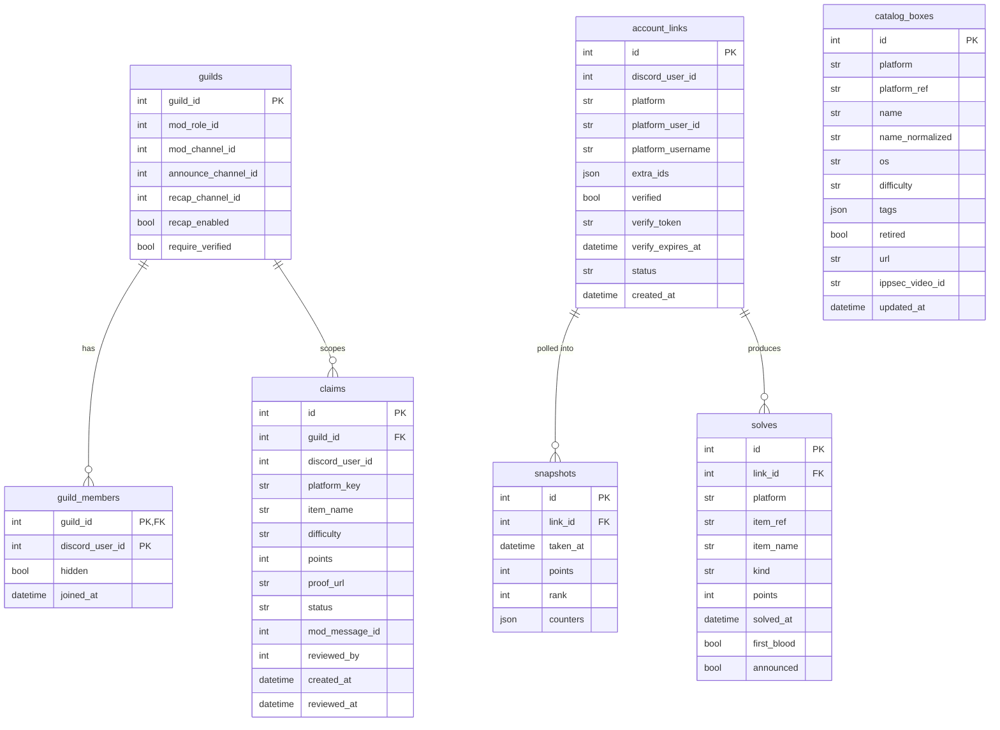

# hackQueue — Architecture & Data Model

> Status: **PROPOSAL** — awaiting review before implementation begins.
> All platform API behavior below was verified with live requests on 2026-07-12 unless marked *docs-only*.

hackQueue is an open-source Discord bot that tracks member progress across CTF/hacking
platforms (Hack The Box, TryHackMe, Root-Me, OffSec Proving Grounds) and runs
server leaderboards. Multi-guild from day one, published under MIT at
`github.com/b-3llum/hackQueue`.

---

## 1. Stack

| Concern | Choice | Why |
|---|---|---|
| Language / runtime | Python 3.12 | CTF/infosec contributors are overwhelmingly Python-fluent (pwntools/requests culture) — the biggest lever for a community-maintained project |
| Discord library | discord.py 2.7 | Actively maintained (2.7.1, 2026-03); `app_commands` slash support mature since 2.0; `discord.ext.tasks` covers pollers |
| ORM | SQLAlchemy 2.0 async | Same ORM code runs on `sqlite+aiosqlite` (default) and `postgresql+asyncpg` (swap `DATABASE_URL`) |
| Migrations | Alembic (async env.py template, batch mode for SQLite ALTERs) | |
| HTTP | aiohttp, one shared session | Central place for UA, caching, backoff, rate limiting |
| Config | env vars via pydantic-settings + `scoring.toml` (stdlib `tomllib`) | Secrets in env, tunables in versioned TOML |
| Logging | structlog (JSON in prod, pretty in dev) | |
| Tests | pytest + pytest-asyncio + aioresponses | HTTP fixtures from captured real responses |
| Lint/format | ruff (both) | One tool, one CI step |
| Packaging | `pyproject.toml`, Dockerfile + docker-compose (volume for SQLite) | |

Not needed: privileged Discord intents. Participation is opt-in via `/link`, so the
bot never enumerates members — keeps self-hosting friction minimal.

---

## 2. Component overview

```
                            ┌────────────────────────────────────────────┐
                            │                 Discord                    │
                            └───────▲────────────────────────▲───────────┘
                                    │ slash cmds / buttons   │ embeds, recap posts
┌───────────────────────────────────┴────────────────────────┴──────────────────┐
│  cogs/          link · leaderboard · profile · claims · boxes · admin(health) │
├────────────────────────────────────────────────────────────────────────────────┤
│  services/                                                                     │
│   linking      snapshots (poller)      scoring (pure fns)      claims          │
│   catalog (box sync)      recap (weekly digest)      health (platform status)  │
├──────────────────────────────┬─────────────────────────────────────────────────┤
│  adapters/                   │  http/client.py                                 │
│   base.py  (protocol +       │   shared aiohttp session · identifiable UA      │
│    normalized dataclasses)   │   per-host token-bucket rate limiter            │
│   htb.py · thm.py ·          │   exponential backoff + jitter on 429/5xx       │
│   rootme.py · registry.py    │   TTL cache + conditional GET (ETag)            │
├──────────────────────────────┴─────────────────────────────────────────────────┤
│  db/  SQLAlchemy async models · Alembic migrations · repository helpers        │
│       sqlite+aiosqlite (default)  /  postgresql+asyncpg (opt-in)               │
└────────────────────────────────────────────────────────────────────────────────┘
```

### Adapter protocol (`adapters/base.py`)

New platform = one new file implementing this, plus a registry entry:

```python
class PlatformAdapter(Protocol):
    platform: Platform                  # enum: HTB, THM, ROOTME, ...
    supports_verification: bool

    async def resolve_user(self, user_ref: str) -> PlatformUser
        # called at /link time: validates the id/username exists,
        # canonicalizes it, captures secondary ids (THM needs 3 — see §4)
    async def get_profile(self, link: AccountLink) -> ProfileStats
        # points, rank, platform-specific counters
    async def get_recent_solves(self, link: AccountLink) -> list[Solve]
    async def get_verification_bio(self, link: AccountLink) -> str | None
        # None => platform can't support bio-token verification
```

Normalized types: `ProfileStats(points, rank, counters: dict)`,
`Solve(item_ref, name, kind, points, solved_at, first_blood)`.
Adapters raise a small normalized error family — `ProfileNotFound`,
`ProfilePrivate`, `AuthExpired`, `RateLimited`, `PlatformUnavailable` — which the
poller maps to per-link status and per-platform health. **A platform outage can
therefore never break other boards**: each adapter poll is isolated, failures mark
the platform degraded, and boards render from the last good snapshots with a
staleness marker.

All URL strings live in a single constants block per adapter file (unofficial APIs
drift; one place to patch).

### Poller (`services/snapshots.py`)

- Per-platform interval from config (defaults: HTB 45 min, Root-Me 60 min, THM 60 min), ±10 % jitter.
- Links polled **spread across the window**, not in a burst — Root-Me throttles per-IP (community-verified 429s), HTB 429s under burst per wrapper authors.
- Each successful poll writes one `snapshots` row and upserts new `solves` rows.
- Snapshots are **global per link** (a user in 5 guilds is polled once).

### HTTP layer (`http/client.py`)

Grounded in live probe results:
- UA: `hackQueue/<version> (+https://github.com/b-3llum/hackQueue)` — all four targets accepted a custom UA where they accepted anything at all.
- Always send `Accept: application/json` to HTB — **without it, auth failures return a 302 to the login page with an HTML body instead of a JSON 401** (live-verified). Redirects are never followed; a 302 from HTB is treated as `AuthExpired`.
- Per-host token buckets: HTB ≥ 1 s spacing, Root-Me ≈ 1 req/s global (shared across all member polls), THM minimal.
- Exponential backoff + jitter on 429/5xx, except: a THM 429 with `x-vercel-mitigated: challenge` (or an HTML body) is **not a rate limit** — it's a bot-mitigation challenge and plain-HTTP retries can never succeed (see §4). It flips the platform to degraded instead of retrying.
- ippsec dataset fetched with conditional GET (ETag) — it's 1.9 MB and changes ~quarterly.

---

## 3. Data model

Links are **global** (one HTB account is one HTB account regardless of server);
board membership is **per guild**. Boards = `account_links × guild_members`.



Constraints and notes:
- `account_links`: unique `(discord_user_id, platform)` and unique `(platform, platform_user_id)` — one account per platform per person, no account claimed twice. Admin override commands can bypass for edge cases.
- `account_links.extra_ids` (JSON): THM needs up to three identifiers across its API generations (username, numeric `userPublicId`, 24-char Mongo ObjectId hash — see §4); HTB/Root-Me leave it empty.
- `account_links.status`: `ok | private | not_found | auth_error` — surfaced in `/profile` and `/health`.
- `snapshots.counters` (JSON): platform-specific extras (HTB `user_owns/system_owns/respects`, Root-Me validation count, THM rooms/badges) without schema churn.
- `solves`: unique `(link_id, platform, item_ref, kind)` — idempotent upserts; `kind ∈ {user, root, challenge, room}`; feeds `/profile`, weekly recap, and `/suggest` exclusion.
- `claims.platform_key` references a **config-defined** manual platform (`pg` ships as default; VulnHub/PortSwigger are new TOML sections, zero code).
- `catalog_boxes.name_normalized`: join key between HTB machine names and ippsec dataset entries (whose `machine` field is dirty — see §4).
- A small `kv` table stores ETags, dataset commit SHA, and catalog sync timestamps.
- Retention: snapshots thinned to one/day after 90 days (config), so SQLite stays small on busy servers.
- **Privacy**: `/unlink` cascades — deletes the link, its snapshots, and solves. Documented in README.

---

## 4. Platform integrations — what live testing found

### Hack The Box (API, bearer token) — *straightforward, one landmine*

- Base `https://labs.hackthebox.com/api/v4/`, single bot-level App Token (env `HTB_APP_TOKEN`, created in profile settings, **expires — max 1 yr — and expiry looks identical to a bad token**, so `/health` alerts on persistent 401s).
- `GET /user/profile/basic/{id}` → `profile.{name, points, rank, ranking, user_owns, system_owns, respects}`.
- `GET /user/profile/activity/{id}` → per-solve events `{date, object_type, type(user|root), id, name, points, first_blood}` — feeds `solves` and `/suggest` exclusion. (The `authUserInUserOwns` flags on catalog endpoints only reflect the *token's own* account — useless for members.)
- Machine catalog: page **both** `/machine/paginated` (active) and `/machine/list/retired/paginated` (retired); Laravel pagination via `meta.last_page`; `stars` is a *string*.
- Landmine (live-verified): auth failures are a clean JSON 401 **only when `Accept: application/json` is sent**; otherwise a 302→HTML login page.
- Cloudflare fronts the API but plain curl with a custom UA passes today; no JS challenge.
- Private profiles: behavior undocumented (likely 404 = "private or nonexistent") — **confirmed empirically in checkpoint 1 with a real token before the error mapping is frozen**.

### TryHackMe (unofficial) — *research surprise #1: currently curl-hostile*

Every `/api/*` endpoint probed (7 requests, residential IP, custom and Chrome UAs)
returned **HTTP 429 `text/html` — a Vercel Security Checkpoint JS challenge**
(`x-vercel-mitigated: challenge`), never reaching the application. This may be
intermittent (Vercel attack mode gets toggled) but community stat-badge projects
have already migrated to Playwright — a strong signal plain HTTP is unreliable now.

Design response — THM is architected as **best-effort with graceful degradation**:
1. Raw-HTTP fast path against the documented endpoints (`/api/discord/user/{username}` — purpose-built for Discord bots, returns `{userRank, points, avatar, subscribed}` — plus v2 `public-profile` and `completed-rooms`), with response-shape validation before parsing since none could be live-verified.
2. On challenge detection: platform flips to `degraded`, poller probes with long exponential backoff (no per-user hammering), boards render stale THM data with a ⚠ staleness timestamp, everything else unaffected.
3. The adapter's fetch layer is a swappable `FetchStrategy`, so a Playwright-based fallback can ship later as an optional extra (`pip install hackqueue[browser]`) without touching adapter logic. Not in initial scope.
4. Identifier mess: v1 endpoints key on username, v2 on `userPublicId` (numeric) or a Mongo ObjectId hash — `resolve_user()` captures all it can into `extra_ids` at link time.

### Root-Me (official API, cookie auth) — *research surprise #2: no bio access*

- Base `https://api.www.root-me.org/` (the `www` matters), auth `Cookie: api_key=<key>` on every request (env `ROOTME_API_KEY`).
- `GET /auteurs/{id}` → `nom`, `score` (*string*), `position`, `rang`, `validations[]` (solved challenges) — one call gives stats **and** solves.
- `GET /auteurs?nom=X` for `/link`-time search help; `/challenges` + `/challenges/{id}` (50/page, `debut_challenges` offset) for the challenge catalog.
- Quirks (live/wrapper-verified): responses are **array-wrapped** (`[{...}, <pagination meta>]`), list objects use numeric-*string* keys, numbers arrive as strings, errors are `[{"error":{"code":401,...}}]`. The Root-Me client normalizes all of this at the edge.
- Rate limits: undocumented, but per-IP 429 throttling is community-verified — global ~1 req/s budget shared across all member polls.
- **Bio-token verification is not viable**: the API response has no bio/presentation field, and the public profile page serves an anti-bot JS challenge to non-browsers (live-verified). See §6.

### OffSec Proving Grounds (manual claims — generic engine)

No API exists. `/solved pg <box> [screenshot]` → pending claim → embed with
Approve/Deny buttons in the configured mod channel (approver needs the configured
mod role) → approved claims award points from the per-difficulty table in
`scoring.toml`. Platform-agnostic: a manual platform is a TOML section
(name + difficulty→points map), so VulnHub/PortSwigger are config, not code.

### Box catalog & recommendations

- Sources: HTB machine endpoints (active + retired) + ippsec dataset + THM room metadata (best-effort, same degradation rules).
- ippsec dataset (fully live-verified): `https://raw.githubusercontent.com/IppSec/ippsec.github.io/master/dataset.json` — 9,245 entries, ~1.9 MB, byte-identical to what ippsec.rocks itself loads. Entries are per-transcript-line: dedupe to ~516 videos; YouTube link = `youtube.com/watch?v={videoId}&t={minutes*60+seconds}`; 17 entries are HTB-Academy modules with **no** `videoId` (branch on `academy` key like the site does). Machine names are dirty (`HackTheBox - X`, `HackThebox - X`, `HackTheBox   X` …) → normalize with case-insensitive prefix strip + whitespace collapse.
- Refresh: daily conditional GET (ETag) or GitHub commits API check; dataset changes ~quarterly.
- `/suggest [platform] [difficulty] [os] [tag]` excludes boxes the requester owns (HTB: from accumulated `solves`; elsewhere best-effort). `/box <name>` renders an info card with platform link + IppSec walkthrough. Optional box-of-the-week scheduled post.

---

## 5. Scoring & leaderboards

All math runs off snapshots, as pure functions in `services/scoring.py`
(the unit-test hotspot).

- **Baseline** for period *P* = latest snapshot at/before *P*'s start; if none (member joined mid-period), the earliest snapshot inside *P*.
- **Delta** = latest snapshot − baseline, floored at 0 per platform metric.
- Periods: weekly = ISO week (Mon 00:00 UTC), monthly = calendar month (UTC).
- **Boards**: per-platform all-time (raw points/rank), per-platform weekly/monthly delta (**default** — rewards activity over account age), and composite.
- **Composite**: per platform, normalize member period-deltas within the guild to 0–100 (max-scaling: leader = 100; a platform with zero total delta contributes 0), then weighted-sum with `scoring.toml` weights. Approved manual claims feed in as their own "platform" through the same normalization.

```toml
# scoring.toml (defaults; servers tune and the README documents the math)
[composite.weights]
htb = 1.0
thm = 1.0
rootme = 1.0
claims = 1.0

[claims.pg]
name = "OffSec Proving Grounds"
[claims.pg.points]
easy = 10
intermediate = 20
hard = 30
insane = 40
```

Boards are computed on demand with a short (60 s) in-memory cache and rendered as
paginated embeds (button-based pagination view).

---

## 6. Account linking & verification

- `/link <platform> <id-or-username>` — adapter `resolve_user()` validates live (clear error if an HTB profile is private), stores canonical ids, registers the user in the invoking guild.
- `/unlink <platform>` — purges link + snapshots + solves (privacy guarantee).
- One account per platform per Discord user (DB-enforced); `/admin link-override` for edge cases.
- **Verification** is a pluggable per-adapter capability:
  - **HTB**: bio-token planned — bot issues an 8-char token, user puts it in their profile description, `/verify htb` checks. *Caveat:* whether the bio field is present in the v4 profile response is unconfirmed without a real token; checkpoint 1 verifies empirically, with a fallback documented if absent.
  - **Root-Me**: **not supportable** (no bio via API; profile page behind anti-bot JS — both live-verified). Root-Me links stay "unverified" and are marked as such on boards. ⚠ *Open decision — see §8.*
  - **THM**: deferred until API access is stable.
- Unverified links render with a ⚠ marker; `require_verified` per-guild config hides them from boards entirely.

---

## 7. Open-source & ops checklist

- MIT `LICENSE`; README with feature list + screenshot placeholders, self-hosting (Docker + bare-metal), token acquisition walkthroughs (HTB App Token, Root-Me api_key), config reference, scoring math, **privacy note** (stores Discord user IDs, platform usernames/IDs, score snapshots; `/unlink` purges).
- `.env.example`: `DISCORD_TOKEN`, `HTB_APP_TOKEN`, `ROOTME_API_KEY`, `DATABASE_URL` (default `sqlite+aiosqlite:///data/hackqueue.db`), `LOG_LEVEL` — each documented with where to get it. `.gitignore` covers `.env`, `*.db`, `data/`.
- `Dockerfile` (slim, non-root) + `docker-compose.yml` (bot + volume).
- GitHub Actions: ruff lint + format check + pytest on PRs.
- `CONTRIBUTING.md` with a "add a platform adapter in one file" walkthrough.
- `/health` (admin): per-platform status (ok/degraded/auth-error), last successful poll, link counts, DB size; structured logs throughout.

---

## 8. Open questions for review

1. **Root-Me verification**: bio-token is impossible (see §4/§6). Recommend shipping Root-Me as unverified-only (marked on boards, excludable via `require_verified`), documented in README. Alternatives: skip Root-Me verification silently, or a weak name-match heuristic. OK with the recommendation?
2. **THM scope**: recommend v1 ships raw-HTTP + graceful degradation only, with the Playwright fallback as a tracked post-v1 issue (it's heavyweight and most self-hosters won't want a browser in the container). Agreed?
3. **HTB token for development**: checkpoint 1 needs a real App Token (HTB → profile settings) to pin down the activity-endpoint shape, private-profile behavior, and whether bio-token verification is possible. Provide one via `.env` when convenient.
4. Naming: repo/bot name assumed **hackQueue** (from the project directory). Confirm or rename now — it ends up in the UA string, package name, and docs.

## 9. Build plan (working checkpoints)

1. **Skeleton + linking + HTB** — repo scaffolding (pyproject, ruff, CI, Docker, README/LICENSE/.env.example from day one), DB + Alembic, `/link` `/unlink` `/profile`, HTB adapter, HTB empirical checks with real token.
2. **Snapshots + leaderboards** — poller, scoring engine + unit tests (deltas, baselines, normalization, composite), `/leaderboard` with pagination.
3. **Root-Me + THM adapters** — including THM degraded mode + verification flow (HTB bio-token).
4. **Claims** — generic manual-claim engine + PG config + mod approval UI.
5. **Box catalog** — HTB machine sync + ippsec ingest + `/suggest` + `/box` + box-of-week + weekly recap.

Each checkpoint ends with the bot bootable and tests green.
